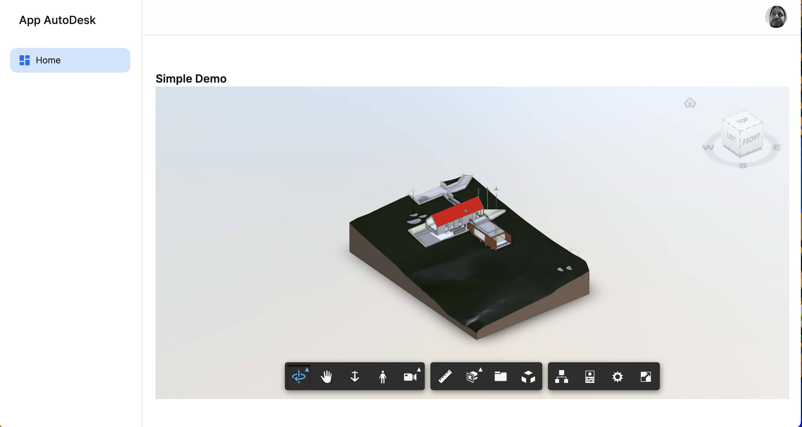

# Autodesk Platform Services Viewer SDK & NextJs

## Viewer SDK



## For Run

Install dependencies

    
```bash
yarn install
```

Start the server

    
        
```bash
yarn run dev
```

Now you can visit https://localhost:3000 in your browser.
